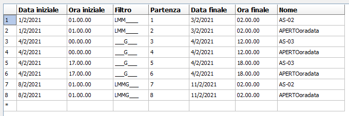

# painless-ible
## The original application
The application (LedBuild) allows to program animations and text for LED panels built by the now foreclosed IBLE Srl. This project only takes in consideration their Pharnacy Cross

The configuration consists of a list of many preset animations called "programs" and customisable scrolling text.

You must define a "base" animation which will be used when no overrides are set

## Scheduling animations

The application provides a calendar window with two levels of nested settings

* "Colour": a set of up to 6 timeslots
* Timeslot: Can go from midnight (00:00) to midnight (24:00). Every timeslot can contain different lists of programs (animations)

Every day of the year can be assigned to a different "colour", like so:


Colour list and hex values:

| colour name  | hex value in savefile |
|--------------|-----------------------|
| Black        | `00`                  |
| Maroon       | `01`                  |
| Green        | `02`                  |
| Olive        | `03`                  |
| Navy         | `04`                  |
| Purple       | `05`                  |
| Teal         | `06`                  |
| Gray         | `07`                  |
| Silver       | `08`                  |
| Red          | `09`                  |
| Lime         | `0a`                  |
| Yellow       | `0b`                  |
| Blue         | `0c`                  |
| Fuchsia      | `0d`                  |
| Aqua         | `0e`                  |
| Orange       | `0f`                  |
| MoneyGreen   | `10`                  |
| Sky          | `11`                  |
| Cream        | `12`                  |
| MedGray      | `13`                  |
| Violet       | `14`                  |
| Pink         | `15`                  |
| Light Maroon | `16`                  |
| Hot Violet   | `17`                  |
| Wood Green   | `18`                  |
| Hot Yellow   | `19`                  |
| Hot Fuchsia  | `1a`                  |
| Color 1      | `1b`                  |
| Color 2      | `1c`                  |
| Color 3      | `1d`                  |
| Color 4      | `1e`                  |
| Color 5      | `1f`                  |


## Savefile dissection

Schedules are output as a binary .cal file and contain 12 solar months of data.

This is the sample content of two schedules called "APERTOoradata" and "AS-02" set on the 1st of January 2021 from 00:00 to 24:00, like so:


```
00000000: 5048 5400 0000 0000 3131 3000 0000 0000  PHT.....110.....
00000010: 312f 312f 3230 3231 2f00 006a 0000 001d  1/1/2021/..j....
00000020: 0000 0000 0000 0000 0000 0000 0000 0000  ................
00000030: 999a 5300 0002 0001 2001 01e5 0701 01e5  ..S..... .......
00000040: 0701 001e 0000 0000 0000 0000 0000 0000  ................
00000050: 0000 0000 0099 9a53 0000 0200 0120 0101  .......S..... ..
00000060: e507 0101 e507 0000 1e1d 4150 4552 544f  ..........APERTO
00000070: 6f72 6164 6174 6120 2020 2020 2020 2020  oradata         
00000080: 2020 1c41 532d 3032 1c1d 00ff 001d         .AS-02......

```

Let's dissect the binary code:

### File header
* Header: `5048 5400 0000 0000 3131 3000 0000 0000  PHT.....110.....`
* Beginning date of schedule. `string(11)`, right-padded with zeroes `312f 312f 3230 3231 2f00 00 1/1/2021/..`
* Length of file. `long`, little endian `6a 0000 00 j...`
* Separator `1D`

### File footer (begins at 69)
* Separator `1D`
* `1C`-separated list of program names, `String`, with unknown amount of padding spaces
* Separator `1D`
* End of block(?) `00 FF 00`
* Separator `1D`

### Program (animation) data
Regardless of the fact that every "colour" already defines a set of predefined programs, the data is expanded in the final savefile, with a block for every program re-expliciting its start and end time, day schedule and colour code, as follows:

`0000 0000 0000 0000 0000 0000 0000 0000 999a 5300 0002 0001 2001 01e5 0701 01e5 0701 00`

`0000 0000 0000 0000 0000 0000 0000 0000 999a 5300 0002 0001 2001 01e5 0701 01e5 0700 00`

* Number of group, increments from 0: `0000`. NOTICE: Accepted values: 0-199.
* Timeslot inside group: `0000`
* Colour of block, `long`: `0000 0000`
* Colour of block (again), `long`: `0000 0000`
* Unknown: `0000 999A 5300`
* End time, minutes, `int`: `00`
* End time, hours, `int`: `02`
* Start time, minutes, `int`: `00`
* Start time, hours, `int`: `01`
* Bitmap of weekdays, `int`: `20`
* End day, `int`: `01`
* End month, `int`: `01`
* Separator `e507`
* Start day, `int`: `01`
* Start month, `int`: `01`
* Separator `e507`
* Index of program `int`. Lookup to the string in the file footer
* Unknown `00`
* End of section: `1e`

Bitmap of weekdays is as follows:
```
10000000 Sunday
01000000 Saturday
00100000 Friday
00010000 Thursday
00001000 Wednesday
00000100 Tuesday
00000010 Monday
The scope of the las bit is most likely `not used`
```

First block after the initial separator has an initial padding `00`. Blocks are separated from eachother by `1E` and then three bytes of zeroes

## Real data dissection:

* Green: 1-3, 8-11 February
  * From 1 AM to 2 AM: AS-02, APERTOoradata
* Navy: 4 February
  * From 12 AM to 12 PM: AS-03, APERTOoradata
  * From 5 PM to 6 PM: AS-03, APERTOoradata

The program already outputs what we should expect to see in the savefile output



Let's look at the complete hex dump!

|Part|Hex|ASCII or value|
|-|-|-|
|Header|`5048 5400 0000 0000 3131 3000 0000 0000`|  PHT.....110.....|
|Starting date|`312f 312f 3230 3231 2f00 00` | 1/1/2021/.. (note: calendar in application starts in January)
|Length of file|`48 0100 001d`| 328|
|Separator|`1D`||
|Data block|(next table)||
|Separator|`1D`||
|Program names|`4150 4552 544F 6F72 6164 6174 6120 2020 2020 2020 2020 2020 1C41 532D 3032 1C41 532D 3033 1C`|<pre>APERTOoradata           AS-02AS-03</pre>|
|Separator|`1D`||
|End of file|`00 FF 00`||
|Separator|`1D`||

As per the picture above we should expect 8 different lines, and we do:

```
      00 00 00 00 00 02 00 00 00 02 00 00 00 00 00 99 9A 53 00 00 02 00 01 0E 03 02 E5 07 01 02 E5 07 01 00 1E 
00 00 00 00 00 00 00 02 00 00 00 02 00 00 00 00 00 99 9A 53 00 00 02 00 01 0E 03 02 E5 07 01 02 E5 07 00 00 1E 
00 00 00 01 00 00 00 04 00 00 00 04 00 00 00 00 00 99 9A 53 00 00 0C 00 00 10 04 02 E5 07 04 02 E5 07 02 00 1E 
00 00 00 01 00 00 00 04 00 00 00 04 00 00 00 00 00 99 9A 53 00 00 0C 00 00 10 04 02 E5 07 04 02 E5 07 00 00 1E 
00 00 00 01 00 01 00 04 00 00 00 04 00 00 00 00 00 99 9A 53 00 00 12 00 11 10 04 02 E5 07 04 02 E5 07 02 00 1E 
00 00 00 01 00 01 00 04 00 00 00 04 00 00 00 00 00 99 9A 53 00 00 12 00 11 10 04 02 E5 07 04 02 E5 07 00 00 1E 
00 00 00 02 00 00 00 02 00 00 00 02 00 00 00 00 00 99 9A 53 00 00 02 00 01 1E 0B 02 E5 07 08 02 E5 07 01 00 1E 
00 00 00 02 00 00 00 02 00 00 00 02 00 00 00 00 00 99 9A 53 00 00 02 00 01 1E 0B 02 E5 07 08 02 E5 07 00 00 1E
```

Let's check them more closely:

|Part | Line1 | Line2| Line3| Line4| Line5| Line6| Line7| Line8|
|-|-|-|-|-|-|-|-|-|
|Header|`00`|`0000 00`|`0000 00`|`0000 00`|`0000 00`|`0000 00`|`0000 00`|`0000 00`|
|Group #|`0000`|`0000`|`0100`|`0100`|`0100`|`0100`|`0200`|`0200`|
|Timeslot|`0000`|`0000`|`0000`|`0000`|`0100`|`0100`|`0000`|`0000`|
|Block colour|`0200 0000`|`0200 0000`|`0400 0000`|`0400 0000`|`0400 0000`|`0400 0000`|`0200 0000`|`0200 0000`|
|Block colour x2|`0200 0000`|`0200 0000`|`0400 0000`|`0400 0000`|`0400 0000`|`0400 0000`|`0200 0000`|`0200 0000`|
|Unknown|``0000 999A 5300``|``0000 999A 5300``|``0000 999A 5300``|``0000 999A 5300``|``0000 999A 5300``|``0000 999A 5300``|``0000 999A 5300``|``0000 999A 5300``|
|End time, m|`00`|`00`|`00`|`00`|`00`|`00`|`00`|`00`|
|End time, h|`02`|`02`|`0C`|`0C`|`12`|`12`|`02`|`02`|
|Start time, m|`00`|`00`|`00`|`00`|`00`|`00`|`00`|`00`|
|Start time, h|`01`|`01`|`00`|`00`|`11`|`11`|`01`|`01`|
|Bitmap of weekdays|`0E`|`0E`|`10`|`10`|`10`|`10`|`1E`|`1E`|
End day|`03`|`03`|`04`|`04`|`04`|`04`|`0B`|`0B`|
End month|`02`|`02`|`02`|`02`|`02`|`02`|`02`|`02`|
Unknown|`e507`|`e507`|`e507`|`e507`|`e507`|`e507`|`e507`|`e507`|
Start day|`01`|`01`|`04`|`04`|`04`|`04`|`08`|`08`|
Start month|`02`|`02`|`02`|`02`|`02`|`02`|`02`|`02`|
Unknown|`e507`|`e507`|`e507`|`e507`|`e507`|`e507`|`e507`|`e507`|
Program index|`01`|`00`|`02`|`00`|`02`|`00`|`01`|`00`|
Unknown|`00`|`00`|`00`|`00`|`00`|`00`|`00`|`00`|
Separator|`1e`|`1e`|`1e`|`1e`|`1e`|`1e`|`1e`|`1e`|