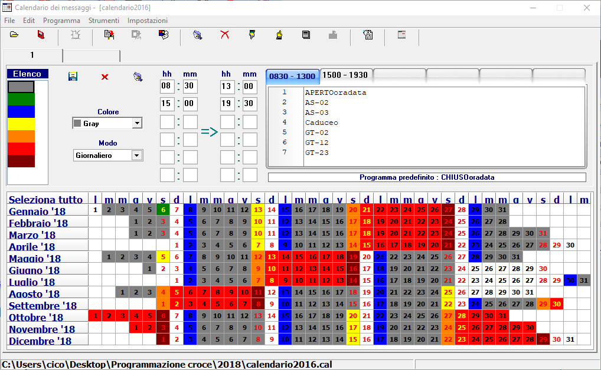
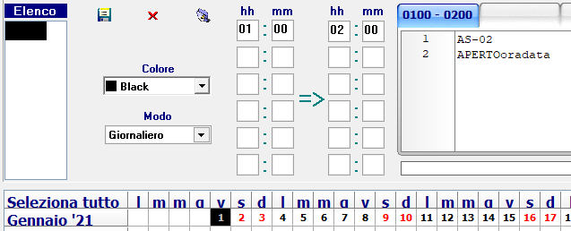

# painless-ible
Because he default LedBulder calendar sucks for me


## The original application
The application (LedBuild) allows to program animations and text for LED panels built by the now foreclosed IBLE Srl. This project only takes in consideration their Pharnacy Cross

The configuration consists of a list of many preset animations called "programs" and customisable scrolling text.

You must define a "base" animation which will be used when no overrides are set

### Scheduling animations

The application provides a calendar window with two levels of nested settings

* "Colour": a set of up to 6 timeslots
* Timeslot: Can go from midnight (00:00) to midnight (24:00). Every timeslot can contain different lists of programs (animations)

Every day of the year can be assigned to a different "colour", like so:



## Savefile dissection

Schedules are output as a binary .cal file and contain 12 solar months of data.

This is the sample content of two schedules called "APERTOoradata" and "AS-02" set on the 1st of January 2021 from 00:00 to 24:00, like so:



```
00000000: 5048 5400 0000 0000 3131 3000 0000 0000  PHT.....110.....
00000010: 312f 312f 3230 3231 2f00 006a 0000 001d  1/1/2021/..j....
00000020: 0000 0000 0000 0000 0000 0000 0000 0000  ................
00000030: 999a 5300 0002 0001 2001 01e5 0701 01e5  ..S..... .......
00000040: 0701 001e 0000 0000 0000 0000 0000 0000  ................
00000050: 0000 0000 0099 9a53 0000 0200 0120 0101  .......S..... ..
00000060: e507 0101 e507 0000 1e1d 4150 4552 544f  ..........APERTO
00000070: 6f72 6164 6174 6120 2020 2020 2020 2020  oradata         
00000080: 2020 1c41 532d 3032 1c1d 00ff 001d         .AS-02......

```

Let's dissect the binary code:

### File header
* Header: `5048 5400 0000 0000 3131 3000 0000 0000  PHT.....110.....`
* Beginning date of schedule. `String(11)`, right-padded with zeroes `312f 312f 3230 3231 2f00 00 1/1/2021/..`
* Length of file. `Long`, little endian `6a 0000 00 j...`
* Separator `1D`
* Padding: 16 bytes of zeroes

### File footer (begins at 69)
* Separator `1D`
* `1C`-separated list of program names, `String`, with unknown amount of padding spaces
* Separator `1D`
* End of block(?) `00 FF 00`
* Separator `1D`

### Program (animation) data
Since the "colour" has two programs we will find two sections, one for each animation, unexplicably separated by 17 bytes of zeroes

`999a 5300 0002 0001 2001 01e5 0701 01e5 0701 001e`

`999a 5300 0002 0001 2001 01e5 0701 01e5 0700 001e`

* Start of block: `999a 5300`
* End time, minutes, `int`: `00`
* End time, hours, `int`: `02`
* Start time, minutes, `int`: `00`
* Start time, hours, `int`: `01`
* Unknown `2001 01e5 0701 01e5 07`
* Index of program `int`. Lookup to the string in the file footer
* Unknown `00`
* End of section: `1e`

